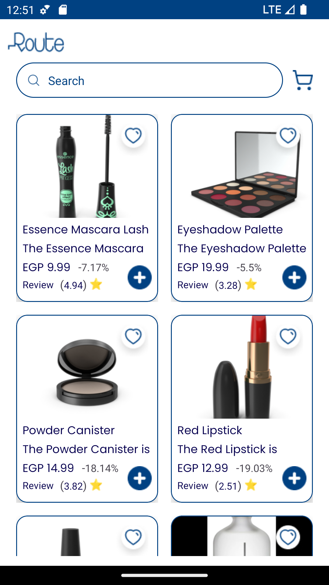
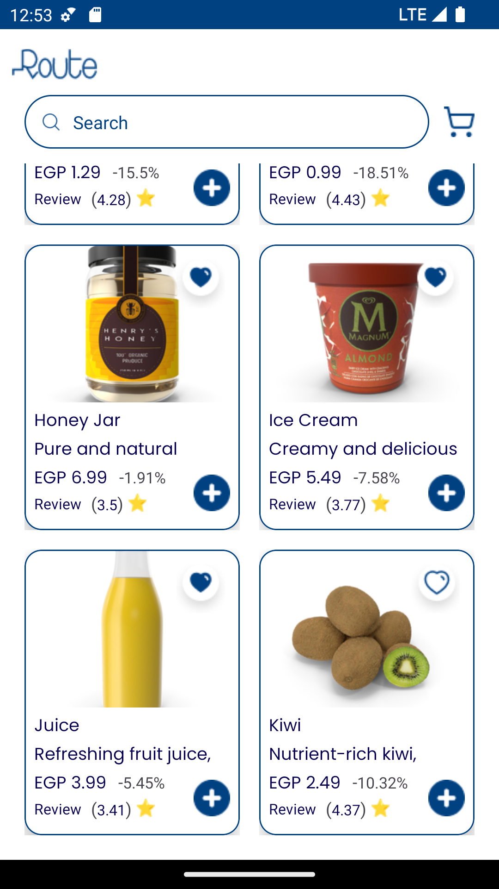
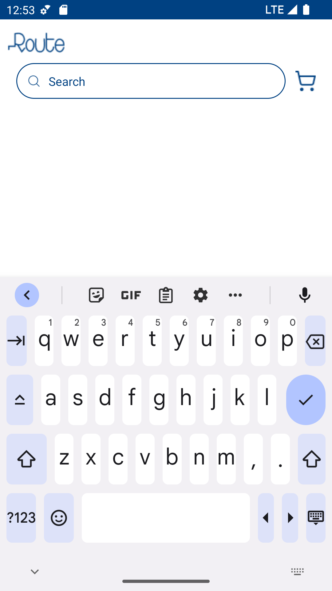
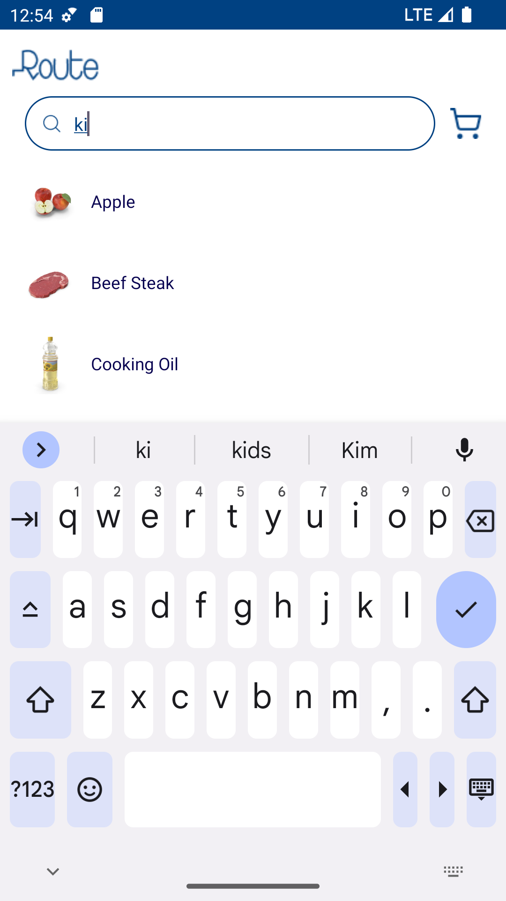
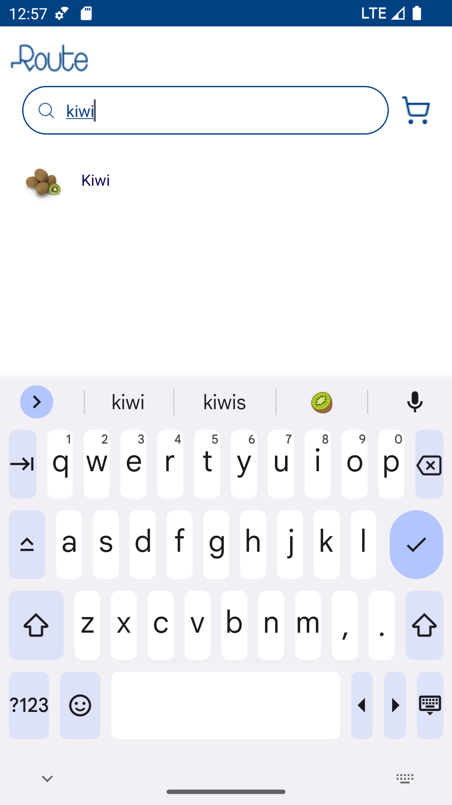

# Route Android Task
Simple Product List with List of Product API.

 Tools:
- Kotlin
- MVVM
- Clean Architecture
- Data Binding
- Retrofit
- Dagger-Hilt
- LiveData
- Glide
- Unit Testing with MockK

# Screen Shots

